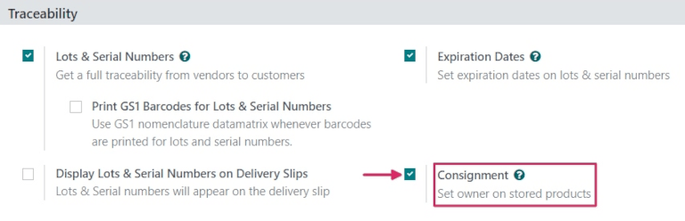
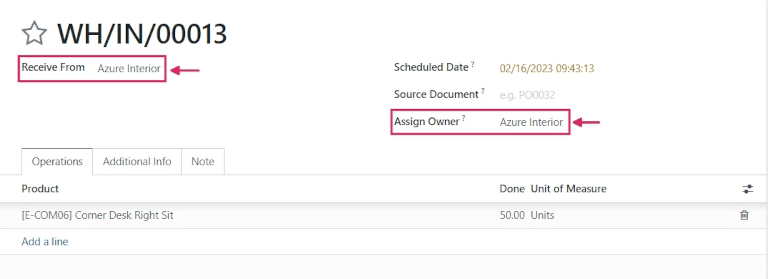
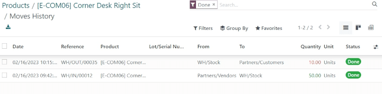

=================================================
Consignment: Buy and Sell Stock Without Owning It
=================================================

Most of the time, products stored in a company's warehouse are either purchased from suppliers, or
are manufactured in-house. However, suppliers will sometimes let companies store and sell products
in their warehouses without having to buy those items up front. This is called **Consignment**.

This is a great way for suppliers to launch new products and easily get them out to their
customers, and a great way for the company storing the products (the consignee) to earn sommething
back for it. Consignees can even charge a fee for the convenience of storing products that they
don't actually own.

Configuration
=============

To receive, store, and sell consignment stock, the *Consignment* feature needs to be enabled. To
enable this, go to :menuselection:`Inventory --> Configuration --> Settings`, and under the
**Traceability** section, check the box next to :guilabel:`Consignment`.

Receive and Store Consignment Stock
===================================

With the *Consignment* feature enabled, consignment stock can now be received into a warehouse.
From the Inventory main dashboard, click into the :guilabel:`Receipts` section. Then, click
:guilabel:`New`.

.. note::
    Consignment stock is not actually purchased from the vendor; it is simply received and stored.
    Because of this, there are no quotations or purchase orders involved in receiving consignment
    stock. So, *every* receipt of consignment stock will start by creating manual receipts.

Choose a vendor to enter in the :guilabel:`Receive From` field, then choose the same vendor to
enter in the :guilabel:`Assign Owner` field.

.. important::
    Since the products received from the vendor will be owned by the same vendor, the
    :guilabel:`Receive From` and :guilabel:`Assign Owner` field must match each other.

Once the vendor-related fields are set, enter products into the product lines, and set the
quantities to be received into the warehouse under the :guilabel:`Done` column. Once everything has
been set, :guilabel:`Validate` the receipt.

Sell and Deliver Consignment Stock
==================================

Once it's been received into the warheouse, consignment stock can be sold the same as any other
product. To create a sales order, navigate to the :guilabel:`Sales` app, and from the
**Quotations** overview, click :guilabel:`New`.

Fill out all the information on the new quotation, and choose a customer to enter into the
:guilabel:`Customer` field.

.. note::
    The :guilabel:`Customer` *must* be different from the vendor that supplied the consignment
    stock received into and stored in the warheouse.

Add the consignment product to the product lines, set the :guilabel:`Quantity`, and once everything
has been filled out, :guilabel:`Confirm`.

.. image:: owned_stock/owned-stock-sales-order.png
   :align: center
   :alt: Sales order of consignment stock.

Once the quotation has been confirmed, it will become a sales order. From here, the products can be
delivered and invoiced for.

Traceability and Reporting of Consignment Stock
===============================================

Although consignment stock is owned by the vendor who supplied it and not by the company storing
it in their warehouse, consignment products will still appear in certain inventory reports. To find
inventory reports, go to :menuselection:`Inventory --> Reporting`, and choose a report to view.

.. note::
    Since the consignee does not actually own consigment stock, these products are *not* reflected
    in the **Stock Valuation** report, and have no impact on the consignee's inventory valuation.

**Stock** Report
----------------

To view the **Stock** report, go to :menuselection:`Inventory --> Reporting --> Stock`. From this
report, information about all stock on-hand can be seen. For consignment products, the information
in this report is the same as any other product: the history of its product moves can be reviewed;
any replenishment rules are listed; its **Locations** are available; and its :guilabel:`Forecasted`
units are listed, as well.

**Locations** Report
--------------------

To view the **Locations** report, go to :menuselection:`Inventory --> Reporting --> Locations`.
From this report, the **Locations** of all stock on-hand are displayed, as well as the quantities
per location. For consigment products, the :guilabel:`Owner` column will be populated with the owner
of those products, or the original vendor who supplied the products in the first place.
