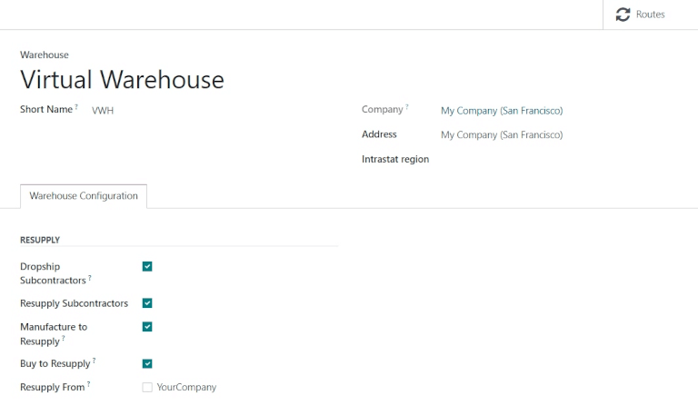
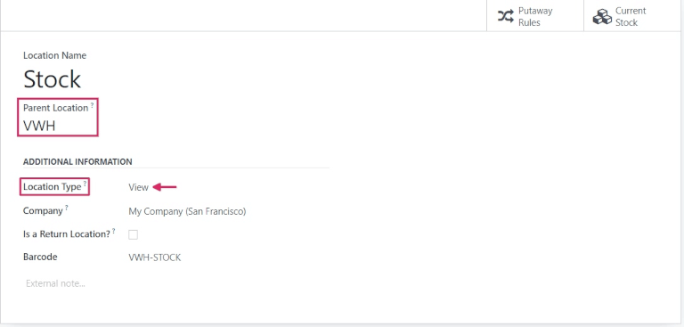
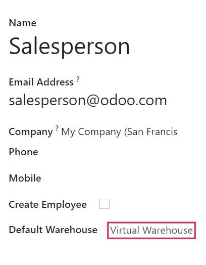
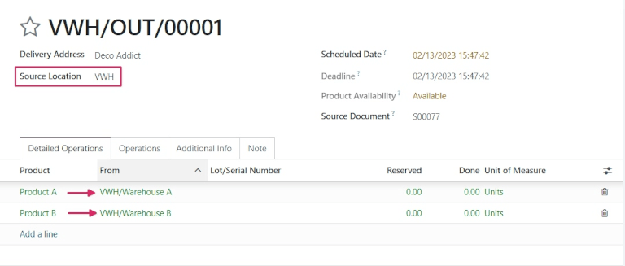

===========================================================
Sell Stock from Multiple Warehouses Using Virtual Locations
===========================================================

While keeping stock and selling inventory from one warehouse might work for smaller companies,
bigger companies might need to keep stock in and sell from multiple warehouses in multiple
locations.

Sometimes, products included in a single sales order might take stock from two or more warehouses.
In Odoo, this can be done by using **Virtual Locations**.

.. note::
   To create virtual locations in warehouses, :guilabel:`Storage Locations` will need to be
   enabled. To do so, go to :menuselection:`Inventory --> Configuration --> Settings`, scroll down
   to the **Warehouse** section, click the checkbox next to :guilabel:`Storage Locations`, and
   :guilabel:`Save` changes.

Create and configure a virtual parent location
==============================================

Before creating any virtual stock locations, a new warehouse will need to be created that will act
as a virtual warehouse, and will be the parent location of other physical warehouses.

Create a new warehouse
----------------------

To create a new warehouse, go to :menuselection:`Inventory --> Configuration --> Warehouses`, and
click :guilabel:`New`. From here, the warehouse name can be changed, as well as other details about
how to resupply the warehouse. Routes can also be set by clicking on the :guilabel:`Routes` smart
button. Once the warehouse is configured, virtual locations can be created.

Create a virtual parent location
--------------------------------

.. important::
   In order to take stock from multiple warehouses to fulfill a sales order, there need to be at
   least **two** warehouses acting as children locations of the virtual parent location warehouse.

To create and edit locations, go to :menuselection:`Inventory --> Configuration --> Locations`. All
locations are listed here,including the stock location of the virtual warehouse that was created.
Click into the stock location for the virtual warehouse created previously, and under the
**Additional Information** tab, change the :guilabel:`Location Type` from *Internal Location* to
*View*. This identifies this location as a virtual one used to create a hierarchical structure for
a warehouse, aggregating its child locations. Products can *not* be stored in this
:guilabel:`Location Type`.

Configure physical warehouse locations
~~~~~~~~~~~~~~~~~~~~~~~~~~~~~~~~~~~~~~

Navigate back to the :guilabel:`Locations` overview via the breadcrumbs, then click into the first
physical warehouse stock location. Under :guilabel:`Parent Location`, select the virtual warehouse
from the drop-down menu. Navigate back to the :guilabel:`Locations` overview and repeat this step
for the second physical warehouse stock location. Both locations are now child locations of the
virtual warehouse parent location.

.. tip::
   To use a virtual parent location as the default warehouse for sales orders, each salesperson can
   have the warheouse assigned to them from the drop-down menu next to
   :guilabel:`Default Warehouse` on their employee form.

Example flow: Sell a product from a virtual warehouse
=====================================================

To sell products from multiple warheouses using a virtual parent location, have at least *two*
products and at least *two* warehouses configured, with at least one product in each warehouse.

To create a new :abbr:`RFQ (request for quotation)`, navigate to the :guilabel:`Sales` app, and
click :guilabel:`New`. Fill out the inforamtion on the new quotation, and add the two products
stored in the two warehouses. Then, click the :guilabel:`Other Info` tab, and change the
:guilabel:`Warehouse` to the virtual warehouse created previously. Once the quotation has been
filled out, :guilabel:`Confirm`.

Now that the quotation has been changed into a sales order, click the :guilabel:`Delivery` smart
button. From here, change the :guilabel:`Source Location` to the virtual warehouse created
previously.

.. note::
   The :guilabel:`Source Location` and warehouse under the :guilabel:`Other Info` tab must match
   for the products included in the sales order to be pulled from different warehouses.

Finally, if they are not set already, change the locations under the :guilabel:`From` column for
each product to the child locations previously tied to the virtual parent location. Once everything
is set, :guilabel:`Validate` the delivery and invoice for the sales order.
