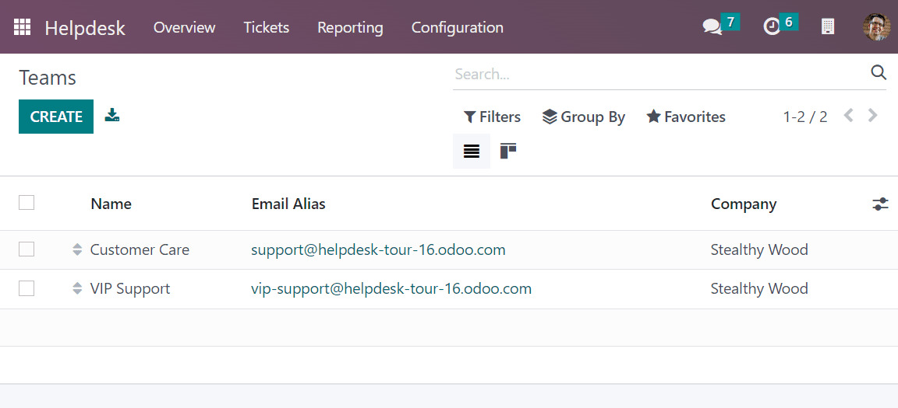
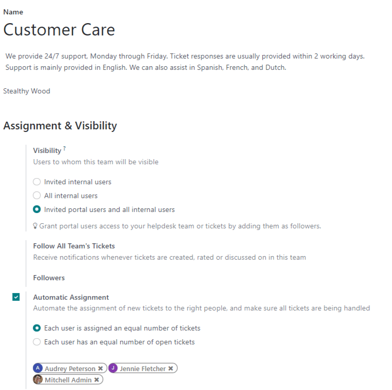
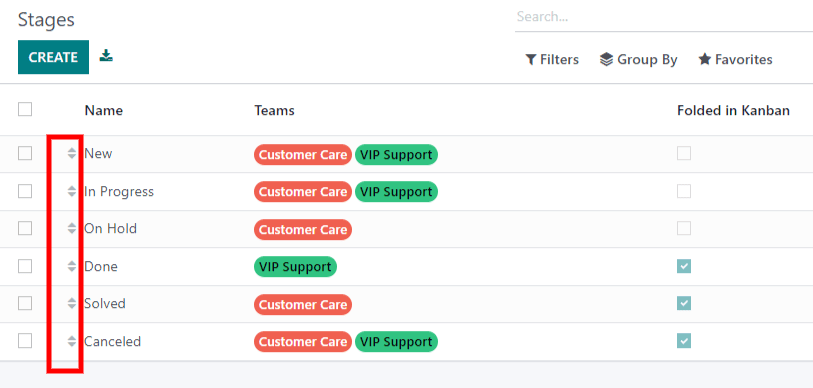
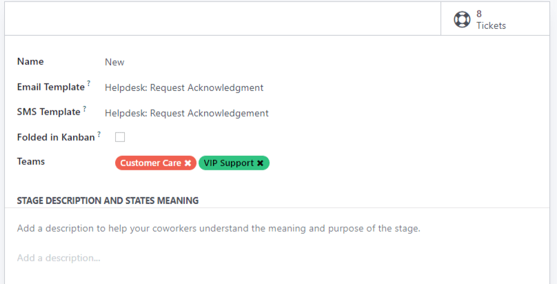
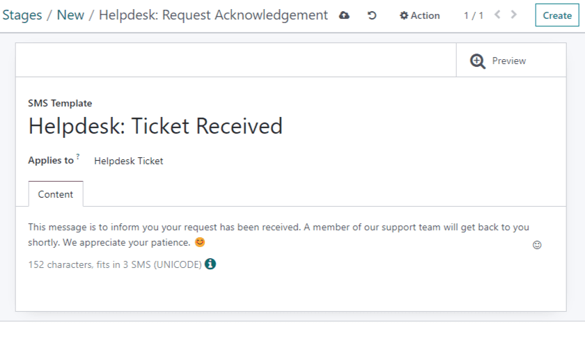
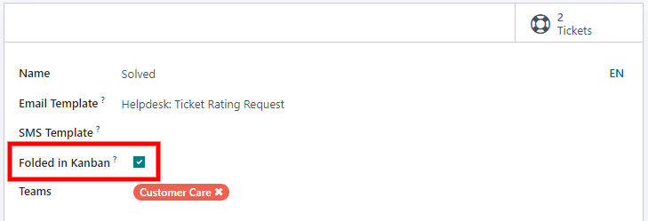

===============
Getting Started
===============

Helpdesk teams provide customers with support to queries or issues they might encounter while using
a product/service. Therefore, having a system in place where multiple teams can co-exist with their
own customized pipeline, visibility settings, and ticket traceability is essential.

Set up teams
============

Setting up multiple teams allows for tickets to be grouped by location
(example: :abbr:`BE/US(Belgium/United States)` ), or by support type (example: IT, accounting, etc.).

To modify or create teams, go to :menuselection:`Helpdesk --> Configuration --> Teams`.

Assignments and visibility
--------------------------

Visibility
~~~~~~~~~~
The *Visibility* feature specifies who can view this team:

- :guilabel:`Invited internal users`: Internal users will have access to the team and tickets
  they are following. This access can be modified on each individual ticket.
- :guilabel:`All internal users`: All internal users will be able to access the team and all of its
  tickets without being a follower.
- :guilabel:`Invited portal users and all internal users`: All internal users can access the team
  and all of its tickets without being a follower. Portal users will only be able to access tickets
  that they are following.

This guarantees that tickets with sensitive or proprietary information will only be seen by the
appropriate users.

Automatic Assignment
~~~~~~~~~~~~~~~~~~~~
Teams can enable *Automatic Assignment* to ensure tickets are redirected to the right person. This
will also ensure that nothing falls through the cracks, as it guarantees all tickets are immediately
assigned to a team member.

Select one of the following assignment methods:

- Each user is assigned an equal number of tickets
- Each user has an equal number of open tickets

         in Odoo Helpdesk

Once :guilabel:`Automatic Assignment` has been enabled, set the *Team Members* among whom tickets
are assigned. Leave the field empty to include all employees (with the proper access rights).
Employees will be skipped if they have recorded time off in the system. If no employees are
available, the system will look ahead until there is a match.

.. seealso::
  - :doc:`receiving_tickets`
  - :doc:`../advanced/after_sales`

Setting up stages
=================

Stages are customizable, and can be renamed to fit the needs of each team.

To configure existing stages, and create new stages, go to
:menuselection:`Helpdesk --> Configuration --> Stages --> Create`.

.. tip::
  The arrow buttons on the left side of the list can be used to change the order of the stages in the
  workflow.  Change the stage order on the kanban view by dragging and dropping individual columns.

Email and SMS templates
-----------------------------------
Stages can be configured to automatically send emails or SMS text messages to a customer.

Select an existing email template in the dropdown menu, or create a new template by typing in the
field :guilabel:`Email Template`.

An SMS template can also be added to send an automated text message to a customer once a ticket has
reached the stage.

.. important::
  SMS Text Messaging is an In-App Purchase (IAP) service that requires prepaid credits to work.
  Refer to :doc:`SMS Pricing and FAQ </applications/marketing/sms_marketing/pricing/pricing_and_faq>`
  for additional information.

Sharing stages among teams
---------------------------------------
A stage can be used by more than one team, but only when it has been assigned. Select the team names
the stage will be used for from the :guilabel:`Team` dropdown.

Folding a stage
---------------------
Stages can be set to be :guilabel:`Folded in Kanban` by default. When a ticket reaches a *folded*
stage, it is considered closed.

.. tip::
  Stages can be temporarily folded in the kanban view, as seen below. This will not close the tickets
  in this stage.

.. image:: getting_started/folded_in_pipeline.png
   :align: center
   :alt: View of Fold setting in Kanban pipeline

.. seealso::
   - :doc:`/applications/general/users`
