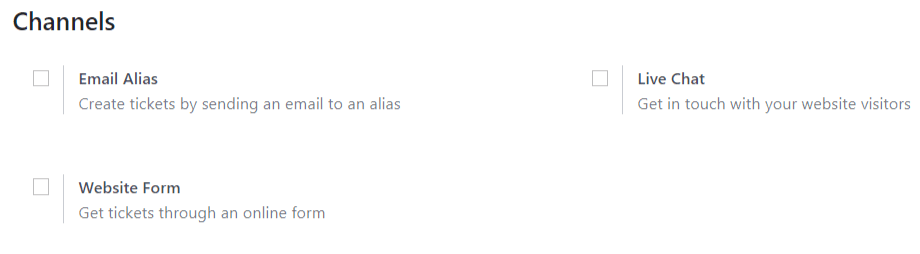
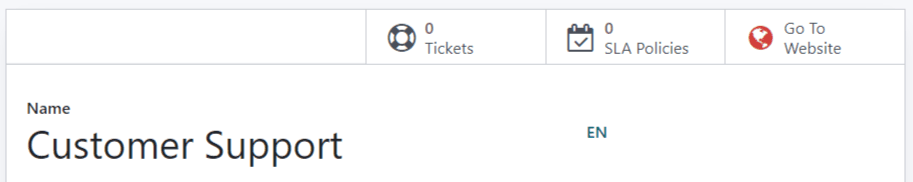
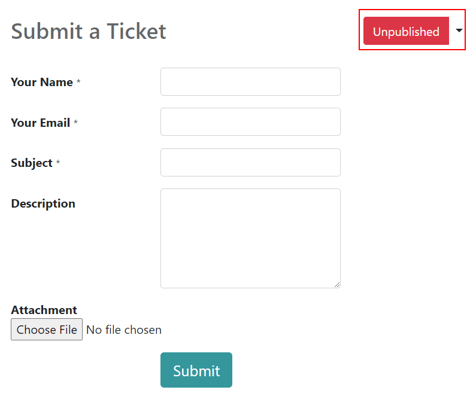
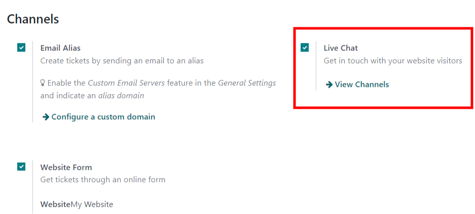

=======================
Start Receiving Tickets
=======================

Helpdesk offers multiple channels where customers can reach out for assistance. In order to ensure
all inquiries are addressed in a timely fashion, it is essential that all interactions are received
in one central location.

Channel options to submit tickets
==================================

Go to :menuselection:`Helpdesk --> Configuration --> Teams --> Channels` to select which
channel options to enable. The available channels are *Email Alias*, *Website Form*, and
*Live Chat*.

Email Alias
-----------

With this setting, users can create a ticket by sending an email to a custom email alias. The
subject line of the email becomes the title of the ticket and the body of the message is added to
the Chatter.

Select :guilabel:`Configure a custom domain` to be redirected to :guilabel:`Settings` and, from
there, enable :guilabel:`Custom Email Servers` to determine or change an :guilabel:`Alias Domain`.
Click :guilabel:`Save`.

.. image:: receiving_tickets/receivingtickets_emailalias.png
   :align: center
   :alt: View of the settings page of a helpdesk team emphasizing the email alias feature
         in Odoo Helpdesk

.. note::
   Using an external email server is required to send and receive emails for On-Premise databases.
   Odoo Online and Odoo.sh customers benefit from a ready-to-use email server.

Website Form
------------

This setting creates an online form that is added to the website. A new ticket is created once a
completed form is submitted.

After the feature is activated, click the :guilabel:`Go to Website` smart button on the team page.

         Odoo Helpdesk

The website form can be customized using the web editor tools. This includes changing what fields
are considered required or not. Once it has been updated, publish it by clicking on
:guilabel:`Unpublished`.

Live Chat
---------

The Live Chat application allows website visitors to connect directly with a support agent or
chatbot. During these conversations, Helpdesk tickets can be instantly created and assigned to the
right team member.

Click on the Helpdesk team's name - for the example below: :guilabel:`Customer Care` - and
:doc:`set up your channel </applications/websites/livechat/overview/get_started>`.

         in Odoo Helpdesk

Now, operators can create tickets by using the
:doc:`command </applications/websites/livechat/overview/responses>` :guilabel:`/helpdesk`.

.. seealso::
   :doc:`/applications/websites/livechat/overview/responses`

Prioritize tickets
==================

All tickets include a :guilabel:`Priority` field. Tickets will be set to *Low Priority* by default,
but the priority can be manually increased at the user’s discretion. The highest priority tickets
will appear at the top of the Kanban and List views.

The priority levels are represented by stars:

- 0 stars = *Low Priority*
- 1 star = *Medium Priority*
- 2 stars = *High Priority*
- 3 stars = *Urgent*

.. warning::
   Priority levels can be used as criteria for assigning SLAs. Changing the priority level can
   alter the SLA deadline and should be considered when changing priority levels.

.. image:: receiving_tickets/receivingtickets_priority.png
   :align: center
   :alt: View of a team’s kanban view and the prioritized tasks in Odoo Helpdesk

.. seealso::
   - :doc:`sla`
   - :doc:`../advanced/close_tickets`
   - :doc:`/applications/general/email_communication/email_servers`
