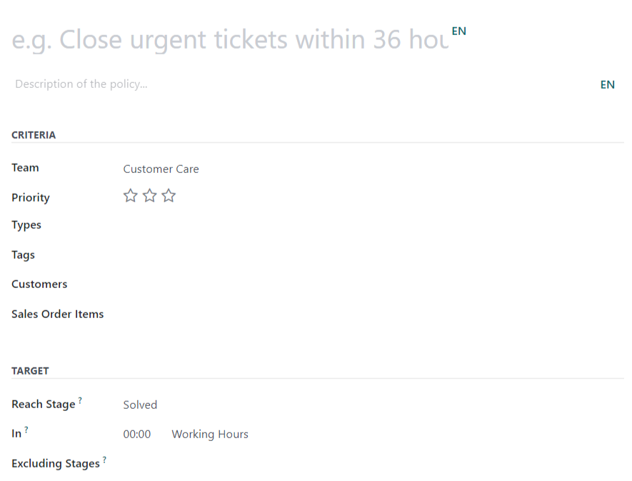
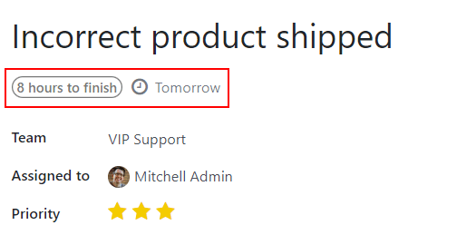
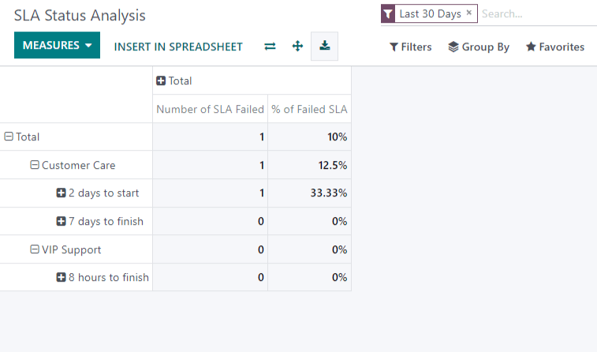

==============================
Service Level Agreements (SLA)
==============================

Service Level Agreements (SLA) are commitments made with customers to define how a service is
delivered. SLAs provide a timeline that tells customers when they can expect results, and keeps the
support team on target.

Create policies
===============

First, enable the SLA Policies feature on each individual team's settings under
:menuselection:`Helpdesk --> Configuration --> Teams`.

.. image:: sla/sla_enable.png
   :align: center
   :alt: View of a team page in Helpdesk focusing on the SLA Policies setting

.. note::
  The :guilabel:`Working Hours` are used to determine the deadline for SLA policies. Working hours
  are based on the :guilabel:`Company Working Hours`.

Create new policies through the smart button on the team`s settings page or go to
:menuselection:`Helpdesk -->  Configuration --> SLA Policies`, and choose the :guilabel:`Team` this
policy is intended for.

Criteria
--------
Choose which of the following :guilabel:`Criteria` to use when applying this policy:

 - :guilabel:`Priority`: If no selection is made, the policy will only apply to tickets marked as
   *Low Priority* (zero stars).
 - :guilabel:`Types`: Multiple types can be selected. If left blank, this policy will apply to all
   ticket types that fit the remaining criteria.
 - :guilabel:`Tags`: Multiple tags can be selected. If left blank, this policy will apply to all tags
   that fit the remaining criteria.
 - :guilabel:`Customers`: Policies can be assigned at a customer level. Multiple customers can be
   selected. If left blank, this policy will apply to all customers.
 - :guilabel:`Sales Order Items`: Policies can be applied to specific line items from sales orders,
   which must be referenced on a ticket in the :guilabel:`Sales Order Item` field.

Target
------
:guilabel:`Target` is the stage a ticket needs to reach within the time period defined to satisfy
the SLA. Any stage can be added to the :guilabel:`Reach Stage` field. Time spent in stages selected
in :guilabel:`Excluding Stages` will not be included in the calculation of the SLA deadline.

.. example::
  An SLA titled “8 Hours to Close” tracks the working time before a ticket is completed, and would
  have *Solved* as the :guilabel:`Reach Stage`. However, if the SLA was titled “2 Days to
  Start”, it tracks the working time before work on a ticket has begun, and would have *In Progress*
  as the :guilabel:`Reach Stage`.

SLA Deadlines
=============
When a ticket fits an SLA policy’s criteria, a deadline is set on the ticket. The deadline is based
on the creation date of the ticket, and the target working hours.

Once a ticket satisfies an SLA policy, the SLA tag turns green, and the deadline field disappears.

.. image:: sla/sla_deadline.png
   :align: center
   :alt: View of a ticket’s form emphasizing a satisfied SLA in Odoo Helpdesk

.. important::
  If a ticket fits the criteria for more than one SLA, the earliest occurring deadline will be
  applied.

SLA Status Analysis
===================

The :guilabel:`SLA Status Analysis` report tracks how quickly an SLA is fulfilled, as well as the
success rate of individual policies. It is found under
:menuselection:`Helpdesk --> Reporting --> SLA Status Analysis`.
By default, the report is filtered to show the number of SLAs failed and the failure rate over the
last 30 days, grouped by team.

Additional measures can be added to track the number of tickets with successful and in progress
SLAs, as well as working hours spent on different stages in the workflow.

.. image:: sla/SLA_statusmeasurements.png
   :align: center
   :alt: View of the SLA status analysis report measurements in Odoo Helpdesk

This report is also available in a :guilabel:`Cohort` view, or in :guilabel:`Graph` view (Pie, Bar
or Line).

.. seealso::
   - :doc:`../advanced/close_tickets`
